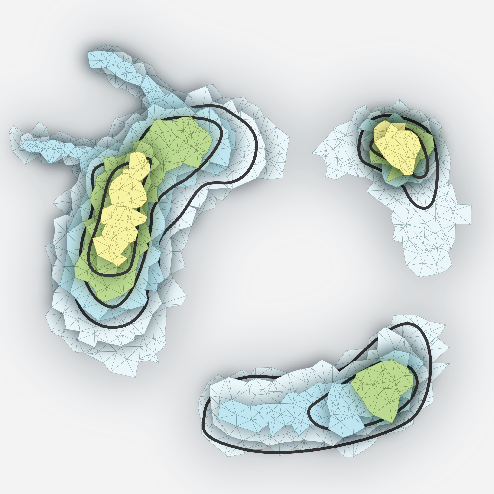

# Automatic isobath generalisation for navigational charts

**Willem van Opstal**  
MSc thesis Geomatics, Delft University of Technology  
July 2020

*The complete thesis is available at the university's [repository][1].*  
*The [abstract](#abstract) follows after the illustration.*

## Abstract

Navigational charts play a vital role in a ship's safety while navigating the seas, rivers or lakes. With most of the features and obstructions being out of sight - below sea-level - these charts are more critical than e.g. topographic maps. For routing but also positioning, depth information is  a key aspect on these charts. This depth information is available in either depth contours, coloured depth areas and individual soundings. However with the data originating from accurate but usually erratic survey data, a visualisation of raw data is not sufficient for use in a navigational chart directly. It would not clearly convey the information to a human operator in one sight, and thus this visualisation is in need of generalisation: a simplified representation of the same data with irrelevant details being omitted. This thesis gives new insights in the generalisation process for isobaths only and proposes a new framework to deal with those.

In navigational charts the amount of generalisation changes with scale and purpose of the chart as well as local properties of the area, e.g. an anchorage or nature reserve. Currently the complex task of defining *irrelevant* details in different situations is in need of lots of manual intervention. That is mainly due to incompatible generalisation constraints: simplifying a line without changing morphology is simply impossible. Especially if the *safety* of the chart should always be guaranteed. An automated generalisation approach would bring economic and safety benefits to the maritime community. This research continues on such an automated approach: the Voronoi- and surface-based approach. The method relies on a triangulated surface of the soundings and generalises it by smoothing. However it lacks a connection with the final cartographic product and thus the generalisation constraints. The method just continues generalisation in an iterative approach, for a finite amount of iterations. There are no means for self-evaluation and thus no means of stopping it when results are acceptable.

In this thesis we propose a framework based on a novel auxiliary data structure to link a triangulation to the resulting isobaths: the *triangle region graph*. It links the position of isobaths directly to individual triangles, as well as establishes relations between the isobaths themselves. With this structure we ultimately link the survey data to the final cartographic product. In theory we could thus integrate all information across the generalisation pipeline in one and the same process. We have successfully used this framework with a basic rule-based evaluation model: first we isolate conflicting isobaths, triangles and vertices based on legibility requirements; then we apply targeted generalisation operators only on these conflicts.

With this approach we can successfully maintain more of the morphology while still yielding a finely legible chart, in comparison with the original Voronoi- and surface-based approach. Especially at large scale charts the results are promising: narrow channels, pits and bends remain if legibility permits. With smaller scale charts the challenge now is to generalise *beyond smoothness*. More radical generalisation operators are needed to omit all irrelevant details. However the overall framework using the triangle region graph as integrating mechanism has potential to do so. It is easily extensible due to its modular approach and can incorporate most depth information: from survey accuracy to size of isobaths and even *golden sounding* selection in the future.

___

*The complete thesis is available at the university's [repository][1].*

[1]: https://repository.tudelft.nl
