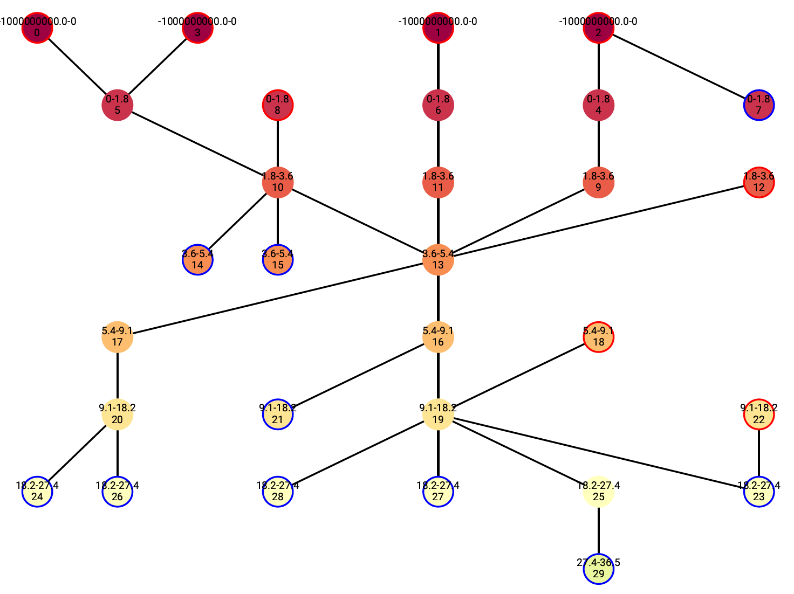
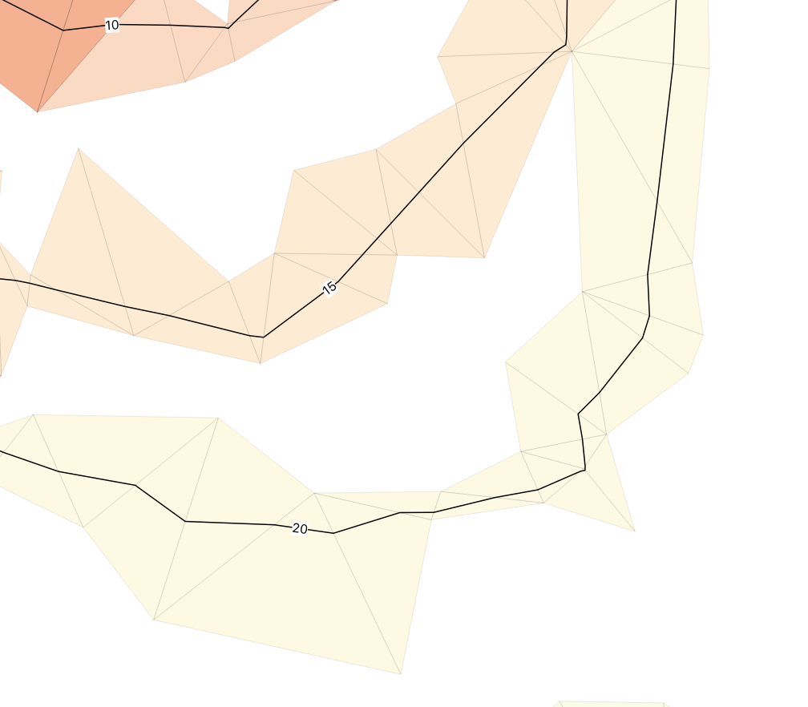

**Hydropolator** is a program to interact with hydrographic survey data with the main purpose of generating and generalizing depth contours for different chart scales. Great attention is given to the fact these contours should be legible, safe, morphological and topological correct.

This conceptual implementation is a proof of concept for my MSc. Thesis in Geomatics: *Automatic isobath generalisation for navigational charts*. The report is available [here](https://repository.tudelft.nl).

*While the code is fully functional, it is not an optimal implementation of the proposed methodology. Be aware of long processing times, especially if variation in the survey data is large.*

# Very short methodology

1. Hydropolator creates a 2.5D Delaunay triangulation of the input points.
1. This triangulation is structured in a novel *Triangle Region Graph*.
1. With this structure, the location of isobaths is directly linked to the triangulation.
1. And because of the triangulation is linked to the input points, the isobaths are linked to the survey data.
1. We establish some constraints for the output of the isobaths.
1. Like smoothness, minimum distance between lines, minimum distance between peaks etc.
1. We check the data for conflicts in these constraints.
1. We isolate the conflicts and possibly extend them with some region.
1. We smooth the conflicting points using the Laplace interpolant.
1. Interpolation is easy, because the data is already structured in a Delaunay triangulation.
1. If the newly interpolated value of a point is shallower than its original, we update it.
1. By doing so, we obtain an always safe surface.
1. If we are happy with the results, or if no conflicts are found anymore, we stop the process.
1. And finally we can extract isobaths, being legible, safe, and geometrically correct.
1. We can also easily extract depth areas, because the Triangle Region Graph structure.


# TOC
- [Installation](#installation)
- [Very simple example](#very-simple-example)
- [Input](#input)
- [Output](#output)
- [Dependencies](#dependencies)
- [Expected File Structure](#expected-file-structure)
- [Implementation](#hydropolator)
    - [Methods](#methods)
    - [Arguments](#arguments)
    - [Variables](#variables)
    - [Attributes](#attributes)
- [Examples](#examples)
- [License](#license)
- [Acknowledgements](#Acknowledgements)
- [Concepts](#concepts)
    - [Triangle region graph](#triangle-region-graph)
    - [Metrics](#metrics)

# Installation

- Download/clone this repository.
- Install GDAL on your computer, add it to your path so you can run the programs from terminal or cmd. Test it, e.g. with `gdal --version`.
- Install/compile [triangle](https://www.cs.cmu.edu/~quake/triangle.html) by following the instructions on its website.
- Place the *triangle* program in the hydropolator directory. See the [expected file structure](#expected-file-structure).
- Download and install all [dependencies](#dependencies), e.g. using pip.
- Load the [very simple example](#very-simple-example), change the path to your survey data (`surveyData`), check the headers in your data and adapt the example to it (`x, y, z`), and run the example.
- See the [implementation details](#hydropolator) for more options.

# Very simple example
```python
from Hydropolator import Hydropolator

# Project properties
projectName = 'newyork'
surveyData = '../Data/NOAA/newyork_5m_30k.csv'
x, y, z = 'x', 'y', 'depth'
epsg = '26918'
flipDepth = True

# Project initialisation
hpl = Hydropolator()
hpl.init_project(projectName)
hpl.load_pointfile(surveyData, 'csv', ' ', x, y, z, flip=flipDepth)
hpl.set_crs(epsg)

# Generalisation parameters
paramDict = {'prepass': 1,
             'densification': 1,
             'process': [],
             'densification_process': [],
             'maxiter': 10,
             'angularity_threshold': 1.6,
             'spurgully_threshold': None,
             'spur_threshold': 100,
             'gully_threshold': 100,
             'aspect_threshold': 0.5,
             'size_threshold': 5,
             'aggregation_threshold': 40,
             'min_ring': 1,
             'max_ring': 4
             }

paramDict['process'] = [['spurs', 0], ['gullys', 0], ['angularity', 0]]
paramDict['densification_process'] = [['angularity', 'r', 0],
                                      ['aspect-edges', 'r', 0],
                                      ['size-edges', 'r', 0]
                                      ]

# Process
hpl.generate_regions()
hpl.build_graph2()
hpl.start_routine_new(paramDict)

# Export
hpl.export_all_isobaths()
hpl.export_depth_areas()
hpl.rasterize(resolution=5.0)
```


# Input
Main input is a simple xyz file of depth measurements or soundings. The data should be projected with meter units.

No additional datasets are needed for now. In the future we will possibly support breaklines (coastlines, drying features) and direction (shipping lanes).

While the goal is to generate isobaths *automatically*, this is not yet fully achieved. You should still input some parameters for the process. See the [implementation details](#hydropolator).

# Output
- Isobaths (shapefile)
- Points (shapefile)
- Depth areas (shapefile)  
- Depth (geotif)
- Triangulation faces/triangles (shapefile)
- TRG Node Triangles (shapefile)
- TRG Edge Triangles (shapefile)
- TRG Network visualization (plot)
- Isobath angularities (shapefile)
- Aggregation areas (shapefile)
- Aggregation points (shapefile)
- Spur/gully triangles (shapefile)
- Spur/gully points (shapefile)
- Various statistics w.r.t. the generalisation process (csv/plots)
- Project files for sharing


# Dependencies

Hydropolator is implemented in Python 3.  It does rely on the following Python packages:

- [StarTIN](https://github.com/hugoledoux/startin_python)
- matplotlib
- networkx
- numpy
- shapefile / pyshp
- pickle
- tabulate
- subprocess
- colorama
- shapely (only for Aggregator.py)

##### Triangle
For some metrics use is made of the non-Python library [*triangle*](https://www.cs.cmu.edu/~quake/triangle.html). This program should be downloaded separately and placed in the same directory. However, the main program will run without this extension, but some features will not work.

##### GDAL
Most geographic files will be output as Shapefiles or GeoTiffs. If you specify a project crs (`hpl.set_crs()`), make sure to have GDAL binaries installed and added to your path. Some GDAL programs will be called from Python. If GDAL is not installed, you can still export shapefiles, but these will not be geo-referenced to a crs. Output in the form of a raster is not possible without GDAL.

# Expected file structure
```
Hydropolator
├── Hydropolator.py                # Main class file
├── ElevationDict.py               # handles the elevations at each vertex/point/sounding
├── Aggregator.py                  # needs Triangle
├── BendDetector.py                # needs Triangle
├── hydrolauncher.py               # CLI (experimental)
├── hydroshortcut.py               # simple interaction examples
├── triangle                       # triangle file must be downloaded from its own website first
├── projects
│   ├── [projectName]              # each project has its own directory with saved data and output.  
│   │   ├── metafile
│   │   ├── triangulationTracker
│   │   ├── triangleRegionGrap
│   │   ├── triangulationVertices
│   │   ├── vertexElevations
│   │   └── [all output files]     # depends on settings  
│   └── ...             
├── plots                          # plotting statistics
│   ├── stats_preparer_[..].py
│   ├── stats_visualizer_[..].py
│   ├── [outputs]
│   └── [stat data]
├── qgis_styles                    # default styles for qgis
│   ├── qgis_style_painter.py      # PyQGIS script, can be imported in qgis
│   └── ... .qml                   # various qgis style files
└── LICENSE
```
*Project directories will be created on initialising a new project. If you want to copy a directory, make sure the included files are present in the structure.*


# Hydropolator

Hydropolator basically is one Python class plus an extra class object for storing the vertices on disk more straightforward. If the *triangle* library is available, it can be extended with more classes *Aggregator* and *BendDetector*.

On initializing a new project, a Hydropolator class is initialized. All operations will take place around this object, so assign it to a variable.

## Initialisation

```python
from Hydropolator import Hydropolator  
hpl = Hydropolator()
```

## Methods

#### Project management
`self.init_project(projectName)`  
Initializes a new (empty) project

`self.load_project(projectName)`  
Loads an existing project. Make sure the five project files specified in the expected file structure are present. Otherwise it will raise an error.

`self.summarize_project()`  
Prints a basic summary of the project, number of points, isobaths etcetera.

`self.set_crs(epsgCode)`  
Sets the crs to the given EPSG. This is only used for export functions. Be aware it will only work if you have GDAL installed and added to your path. Otherwise the export functions will raise an error.

#### Points

`self.load_pointfile(pointfile, fileType, delimiter, xName, yName, dName, flip)`  
This loads a .xyz pointfile, filters on snapping tolerance and triangulates the points for further use.

#### Shutting down
`self.write_metafile()`  
Saves some basic data to be able to open the same object again on loading an existing project.

`self.save_triangulation`  
Saves the triangulation object for loading an existing project later.

`self.save_trGraph()`  
Saves the triangulation region graph for loading again.

#### Exporting

`self.export_all_isobaths()`  
Exports all isobaths in the project to shapefiles.

`self.export_depth_areas()`  
Exports the depth areas to shapefiles. Only DEPAREs which are fully contained by closed isobaths are recognized.

`self.export_all_node_triangles`  
Exports the nodes from the triangle region graph in the form of a collection of triangles (shapefile).

`self.export_all_edge_triangles`  
Exports the edges from the triangle region graph in the form of a collection of triangles (shapefile).

`self.export_shapefile()`  
Exports basic triangles and vertices in two separate shapefiles with some information on the triangle intervals for triangles, and updates and difference in depth for the vertices.

`self.rasterize(resolution)`  
Rasterizes the data and exports it to a GeoTiff. Make sure to have GDAL binaries installed and that you have set a crs with `self.set_crs()`. Interpolation is now done using LaPlace interpolant on a grid of pixels.

#### Miscellaneous
`self.print_errors()`  
Some errors in the process are captured and can be printed through this method. Be aware not all errors are yet printed!

#### Statistics
Some basic statistics are supported. However we need to set certain bins for visualization of these statistics.

`self.set_sharp_points_bins(sharpPointsBreakpoints)`  
`self.set_abs_change_bins(absoluteChangedPointsBreakpoints)`  
`self.set_min_change_bins(minChangedPointsBreakpoints)`  
`self.set_iso_seg_bins(isoLengthBreakpoints)`  
All arguments are simple lists with breakpoints.

`self.export_statistics()`  
Exports various csv files in the project directory.

## Arguments

`pointFile` is simply the path to your survey data.

`flip` determines if the depth value in your source data should be flipped. It defaults to False. Depth should defined as watercolumn below sea-level. If there is water, depth value is positive. Is it is drying, depth value is negative. By setting flip to True, original depth values from datafile will be flipped.

## paramDict

The `paramDict` argument is where most of your input will be defined. It contains all information for the smoothing process to be executed. It *must* contain the following entries:

```python
paramDict = {'prepass': 1,
             'densification': 1,
             'process': [],
             'densification_process': [],
             'maxiter': 10,
             'angularity_threshold': 1.6,
             'spurgully_threshold': None,
             'spur_threshold': 100,
             'gully_threshold': 100,
             'aspect_threshold': 0.5,
             'size_threshold': 5,
             'aggregation_threshold': 40,
             'min_ring': 1,
             'max_ring': 4
             }

paramDict['process'] = [['spurs', 0], ['gullys', 0], ['angularity', 0]]
paramDict['densification_process'] = [['angularity', 'r', 0],
                                      ['aspect-edges', 'r', 0],
                                      ['size-edges', 'r', 0]
                                      ]
```

# Statistics

## Morphology

## Depth change

## Smoothness

## Smoothing process


# License

This project is licensed under a [GPL V3.0 licence](https://github.com/willemvanopstal/hydropolator/blob/master/LICENSE).

The accompanying report -  [my MSc. Thesis](https://repository.tudelft.nl) - is available under a [CC BY-SA 3.0](https://creativecommons.org/licenses/by-sa/3.0/) license.

# Acknowledgements

First of all great thanks to my two supervisors for all support during my graduation process: Dr. **Martijn Meijers** and Dr. **Ravi Peters**.

The voronoi surface based approach for generating isobaths was first examined by Dr. **Hugo Ledoux** and later expanded by Dr. Ravi Peters in his MSc. Thesis.

This implementation builds and relies on the [**StarTIN**](https://github.com/hugoledoux/startin_python) triangulation library from Hugo Ledoux. Only because of his simple but versatile implementation of a Delaunay triangulation, hydropolator could function in its current use.

For the more advanced metrics, the [**triangle**](https://www.cs.cmu.edu/~quake/triangle.html) triangulation library is used. It supports a great constrained Delaunay triangulation with lots of controls.

# Concepts

## Region graph

The triangle region graph is an adaptation of the region graph, but now ported to be used for triangulations. A region graph establishes adjacency information between equal-level areas/regions. See literature.

We first need to define the isobath levels needed for our chart. The standard IHO levels are for example 2,5,8,10,20m etc. NOAA uses another variant based on the conversion of feet: 1.8, 3.6, 5.4m etc.

A region is now defined as the vertical span between two consecutive isobath values. E.g. `1.8m - 3.6m` is one region. `-inf - 1.8m` another.

Regions are reflected as nodes in the region graph.

Two or more regions can be adjacent to each other. In that case, an isobath is always in between. Therefore, an edge represents a particular isobath. Its value is defined as the overlapping value between two regions/nodes. In the example of node `-inf - 1.8m` being adjacent to node `1.8m - 3.6m`, the edge or isobath in between has value `1.8m`.



## Triangle region graph

Hydropolator relies on a similar structure being the triangle region graph. In the triangle region graph, regions are not defined polygons, but as sets of triangles or faces in the triangulation.

A 2.5D triangle will have a certain vertical span, based on its minimum and maximum values. Take for example a triangle with its vertices having `2.8, 4.5 and 3.1m` as z-values. It thus spans the vertical between `2.8m` and `4.5m`.

Related to the already defined isobath values, this particular triangle falls in the regions `1.8m - 3.6m` and the region `3.6m - 5.4m`.

By computing this for every triangle in the triangulation we can establish a triangle region graph. Nodes are in this case represented by sets of triangles.

Triangles can be part of multiple nodes, such as the example given.

Edges in this case not directly an isobath, but also a collection of triangles. Specifically, the set of triangles overlapping two different, but adjacent nodes.

An isobath (line) will always run across this set of triangles. Take for example the triangle described above. We already now that the 3.6m isobath will run across this triangle.




===

# Older (to be removed)
#### `load_pointfile(pointFile, fileType, delimiter, xName, yName, dName, flip) -> None`
This loads a .xyz pointfile, filters on snapping tolerance and triangulates the points for further use.
> `pointFile <- str/os.path (None)` path to pointfile  
> `fileType <- str ('csv')` can be csv or shapefile. Shapefile for now not supported  
> `delimiter <- str (None)` csv delimiter  
> `xName <- str ('x')` field for x-coordinate  
> `yName <- str ('y')` field for y-coordinate  
> `dName <- str ('depth')` field for depth value  
> `flip <- Bool (False)` depth is defined as watercolumn below sea-level. If there is water, depth value is positive. Is it is drying, depth value is negative. By setting `flip` to `True`, original depth values from datafile will be flipped.


---
#### `start_routine_new(paramDict, statistics) -> None`
This initiates the smoothing and densification routine. Make sure to pass all parameters needed. The function returns nothing, but changes the data in the parent class.
> `paramDict <- dict (None)` parameters for the process. (see paramDict)  
> `statistics <- Bool (False)` Generates statistics for each iteration

---

#### `start_routine_new(paramDict, statistics) -> None`
This initiates the smoothing and densification routine. Make sure to pass all parameters needed. The function returns nothing, but changes the data in the parent class.
> `paramDict <- dict (None)` parameters for the process. (see paramDict)  
> `statistics <- Bool (False)` Generates statistics for each iteration

---
## Arguments

#### `paramDict <- dict`
This dictionary is used to collect all parameters for the smoothing and densification process. It *must* have all these keys:
> `prepass <- int` number of smoothing iterations, applied on all vertices in the dataset  
> `densification <- int` number of densification iterations, applied after the overall smoothing  
> `maxiter <- int` maximum iteration count, including prepasses, excluding densification  
> `min_ring <- int` number of rings which is always added around identified conflicting triangles  
> `max_ring <- int` number of rings on which the smoothing process will stop. Conflicts are unlikely to be resolved further  
> `process <- dict` parameters dictating what metrics should be used in the smoothing routine (see process)  
> `densification_process <- dict` parameters dictating what metrics should be used in the densification routine (see densification_process)  
> `..._threshold <- float` threshold for ...  
> `..._threshold <- float` threshold for ...  
> `..._threshold <- float` threshold for ...  
> `..._threshold <- float` threshold for ...  
> `..._threshold <- float` threshold for ...  

##### `paramDict['process'] <- list`
Parameters dictating what metrics should be used in the smoothing routine.  
It must be a list with possible entries: `['angularity', 0], ['spurs', 0], ['gullys', 0]`. The second entry of each entry is deprecated, but may be activated manually.

##### `paramDict['densification_process'] <- list`
Parameters dictating what metrics should be used in the densification routine.  
It must be a list with possible entries: `['angularity', 'r', 0], ['aspect-edges', 'r', 0], ['size-edges', 'r', 0]`. The second entry in each entry (`'r'`) dictates how each identified conflicting triangle should be extended, and the third entry (`0`) dictates the amount of extension.

---

## Variables

#### `prepass`

## Attributes


# Examples

## hydroshortcut.py
 **Starting a project:**
 - Possibly need to create a directory `projects`
 - First initiate a new project with .init()
 - Directly load a pointfile with .load_pointfile()

```python
projectObject.init_project(projectName)
projectObject.load_pointfile(surveyData, 'csv', ' ', flip=True)
```

**Loading existing project:**
 - Make sure to comment out the initiation step
 - Load the project with .load_project()

``` python
projectObject.load_project(projectName)
```

**Saving a project**

``` python
if projectObject.vertexCount:
  projectObject.save_triangulation()
if projectObject.nrNodes:
  projectObject.save_trGraph()
```

**Triangle Region Graph**
```python
# adds every triangle to one or more regions which it belongs to
projectObject.generate_regions()
# builds the actual graph
projectObject.build_graph2()
# creates a pdf with a visualisation of the graph
projectObject.make_network_graph()
```

**Exporting to shapefiles**
``` python
# export all nodes in groups of triangles, with neighboring nodes etc.
projectObject.export_all_node_triangles()
# export only the edge-triangles, with its value
projectObject.export_all_edge_triangles()
# export all vertices and triangles
projectObject.export_shapefile('output')
```
**Isobaths**
```python
# generates lines through the edge-triangles
projectObject.generate_isobaths4()
# exports the lines to shapefile
projectObject.export_all_isobaths()

# isobaths should have been generated before this to work
# check the angularities in each isobath /
# if edgeIds is empty, all edges are handled
# threshold in radians determines which points are returned
sharpPoints = projectObject.check_isobath_angularity(edgeIds=[], threshold=0.6)
# export points with their angularity-unit
projectObject.export_all_angularities()
```

**Smoothing**
```python
# first define which vertices needs to be smoothened e.g.
sharpPoints = projectObject.check_isobath_angularity(edgeIds=[], threshold=0.6)
nodePoints = projectObject.get_vertices_from_node(nodeId)

verticesToSmooth = set()
# increase the numer of vertices by expanding to its neighbors
# rings define how many triangle-rings around the sharpPoint will be added
for point in sharpPoints:
    verticesToSmooth.update(projectObject.get_vertices_around_point(point, rings=1))
print('nr vertices: ', len(verticesToSmooth))

# smooth the indexed vertices and rebuild the entire graph
# within Hydropolator.simple_smooth_and_rebuild() an iteration-count is hard-coded
# this iteration-count smooths the given vertices only by a certain amount
projectObject.simple_smooth_and_rebuild(verticesToSmooth)

# now export all information of interest again for comparison
# isobaths have to be generated again as well
```

## hydrolauncher.py
This script can be used to interact with the projects in a terminal window. It is not fully functional yet, mainly used for quick experiments but has some more functionality than the hydroshortcut.py described above.
